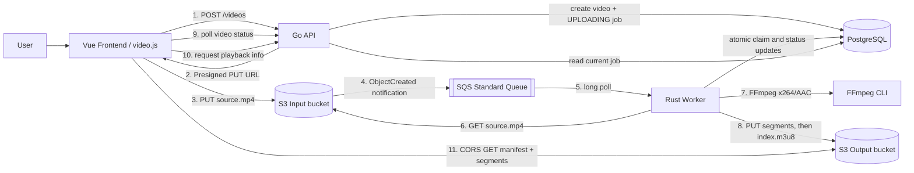
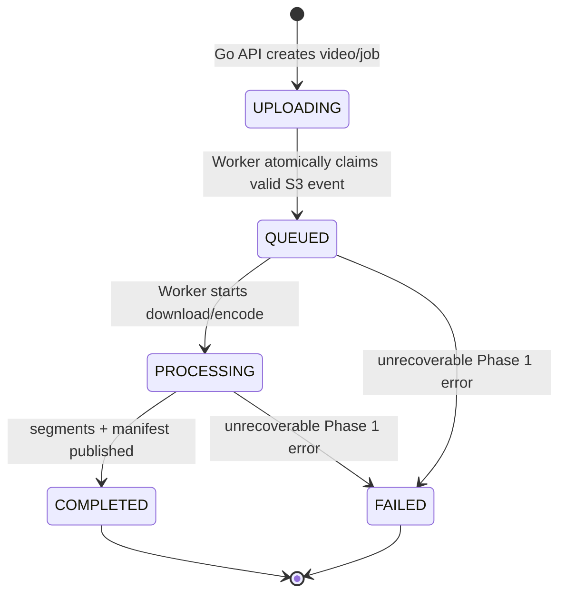

# Streaming Video App

## Project Overview

Streaming Video App は、動画アップロードから非同期エンコード、HLS生成、ブラウザ再生までを一つのパイプラインとして学ぶための、個人開発MVPです。自己学習とポートフォリオを主目的とし、APIの応答処理と時間のかかる動画変換を分離した、最小のストリーミング動画アプリケーションを実装しています。

現在の実装範囲は Phase 1 です。目標は、次の正常系E2Eを成立させることです。

```text
Upload -> asynchronous Encode -> HLS generation -> Playback
```

このリポジトリは本番向け動画配信サービスではありません。Phase 1では、Frontend、Go API、Rust Worker、PostgreSQLをローカルで実行し、S3、SQS、IAMだけ実AWSを利用します。

## What this application does

ユーザーはブラウザでMP4ファイルを1つ選び、アップロードします。動画データはAPIサーバーを経由せず、Go APIが発行したPresigned PUT URLを使ってInput S3 bucketへ直接送信されます。

アップロード完了をS3の `ObjectCreated` 通知がSQSへ伝え、Rust Workerがメッセージを受信します。WorkerはInput bucketから動画を取得し、FFmpeg CLIで単一品質のHLS playlistとMPEG-TS segmentsへ変換します。変換結果はOutput S3 bucketへ配置され、ジョブ完了後にFrontendがvideo.jsを使って再生します。

Frontendは処理中、Go APIをポーリングしてジョブ状態を表示します。Phase 1ではCloudFrontを使用せず、ブラウザがOutput S3 bucketのHLSオブジェクトをCORS経由で直接取得します。

## Architecture Overview



責務の境界は次のとおりです。

- Go APIはジョブを作成し、アップロード先を発行し、現在状態と再生情報を返します。動画本体の中継やエンコードは行いません。
- Rust WorkerはSQSメッセージを起点に、claim、ダウンロード、エンコード、公開、状態更新を行います。ブラウザ向けAPIは提供しません。
- Frontendはユーザー操作、S3への直接アップロード、状態ポーリング、HLS再生を担当します。AWS認証情報は持ちません。
- PostgreSQLは動画メタデータ、アップロード情報、現在のジョブ状態を保持します。
- TerraformはPhase 1で必要なS3、SQS、IAMを定義します。Frontend、API、Worker、PostgreSQLのAWSデプロイは定義しません。

## Component Responsibilities

### Frontend

`frontend/` は Vue 3、TypeScript、Viteで構成されています。

- 空でない `video/mp4` ファイルを1つ受け付ける
- `POST /videos` で動画とエンコードジョブを作成する
- APIレスポンス内のPresigned URL、HTTP method、headersを使ってS3へ直接PUTする
- 既定1秒間隔で `GET /videos/{videoId}` をポーリングする
- `FAILED` をエラー表示し、`COMPLETED` で再生情報を取得する
- video.jsへHLS manifest URLを渡して再生する
- APIレスポンスを実行時に検証し、契約外の値をエラーとして扱う

### Go API

`backend/api/` はGoの標準 `net/http`、AWS SDK for Go v2、pgxを利用します。

- `POST /api/v1/videos`
  - `fileName`、`contentType`、`sizeBytes` を検証する
  - Phase 1では `video/mp4`、1 byte以上5 GiB以下だけ受け付ける
  - video IDとjob IDを生成する
  - jobを `UPLOADING` としてPostgreSQLへ保存する
  - 15分有効のS3 Presigned PUT URLを発行する
- `GET /api/v1/videos/{videoId}`
  - 動画メタデータと現在のジョブ状態を返す
- `GET /api/v1/videos/{videoId}/playback`
  - `COMPLETED` のときだけHLS manifest URLを返す
  - 未完了時は `409 VIDEO_NOT_READY` を返す
- `GET /api/v1/health`
  - ComposeとE2E preflight用のヘルスチェックを返す
- 設定されたFrontend originだけにJSON APIのCORSを許可する

APIは起動時にPostgreSQL接続、`videos` / `jobs` table、AWS credential providerを確認します。S3へのアップロード完了通知やSQSへのメッセージ送信はAPIの責務ではありません。

### Rust Worker

`backend/worker/` はCargo workspaceで、`worker`、`encoding`、`queue`、`storage`、`persistence` crateに責務を分けています。

- SQSを20秒long pollingし、1回に1 messageを受信する
- 1 process内の処理数を固定上限に抑える（現在の上限は2）
- standard S3 Event Notificationの全 `Records` を解析する
- event name、Input bucket、URL decode後のobject key、UUID形式を検証する
- PostgreSQLの条件付きUPDATEで `UPLOADING -> QUEUED` を原子的にclaimする
- `QUEUED -> PROCESSING` 後にInput S3 objectを一時ディレクトリへ保存する
- shellを介さずFFmpeg CLIを起動し、H.264/AAC、6秒segment、VOD形式のHLSを生成する
- playlistと連番segmentの存在・安全な相対パスを検証する
- Output S3へ全segmentsを先にuploadし、`index.m3u8` を最後にuploadする
- 一時ファイル削除後、jobを `COMPLETED` にする
- 所有した全jobが成功した場合だけSQS messageをdeleteする
- 処理失敗時はjobを `FAILED`、failure codeを `ENCODING_FAILED` にする

Worker containerには固定バージョンのFFmpeg / ffprobe 7.1.1が含まれ、非root userで実行されます。

### Infra

`infra/terraform/` はPhase 1のAWS foundationを定義する単一のTerraform rootです。

- 分離されたInput / Output S3 buckets
- SQS Standard Queue
- `s3:ObjectCreated:*` からSQSへの通知
  - prefix: `videos/`
  - suffix: `/source.mp4`
- Input bucketのpublic access blockと、FrontendからのPUT CORS
- Output bucketのHLS prefixだけに限定したpublic `s3:GetObject` とGET/HEAD CORS
- S3からSQSへの送信を `SourceArn` / `SourceAccount` で制限したqueue policy
- Go API用のInput `s3:PutObject` 権限
- Rust Worker用のSQS consume、Input read、Output write権限
- API / Workerで分離されたローカル実行用IAM usersとpolicies

TerraformはIAM access keyを生成しません。認証情報の発行・保管・ローテーションはこのリポジトリの対象外です。

### Contracts

`contracts/` がコンポーネント間の共有契約です。

- [OpenAPI 3.1 contract](./contracts/openapi/api.yaml): create、status、playback APIとレスポンス例
- [Job status schema](./contracts/domain/job-status.schema.json): Phase 1の5状態
- [Storage conventions](./contracts/domain/storage-conventions.md): bucketの役割、S3 keys、S3 event、HLS公開順序
- `contracts/examples/api/`: OpenAPIから参照されるcanonical API examples
- `contracts/examples/s3/object-created.json`: Workerが解釈するcanonical S3 notification fixture

Phase 1では独自の `encoding-requested`、`encoding-progress`、`encoding-completed` eventsを使用しません。SQS message bodyはAWS標準のS3 Event Notification JSONです。

## End-to-End Flow

1. ユーザーがFrontendで空でないMP4ファイルを1つ選びます。
2. Frontendがファイル名、`video/mp4`、サイズをGo APIへ送ります。
3. Go APIがvideo/job IDsとcanonical Input keyを生成し、そのkey専用のPresigned PUT requestを作成します。
4. Go APIがPostgreSQLへvideoと `UPLOADING` jobをtransactionで保存し、Presigned URLをFrontendへ返します。
5. BrowserがAPIを経由せず、返されたURLとheadersで動画をInput S3 bucketへPUTします。
6. S3がkey filterに一致する `ObjectCreated:*` notificationをSQSへ送ります。
7. Rust Workerがnotificationを受信し、Input bucketとkeyを検証して、jobを原子的に `QUEUED` へclaimします。既にclaim済みならエンコードしません。
8. Workerがjobを `PROCESSING` にし、元動画をInput S3から一時ディレクトリへ取得します。
9. WorkerがFFmpegで単一品質のHLS playlistとMPEG-TS segmentsを生成し、生成物を検証します。
10. WorkerがsegmentsをOutput S3へuploadし、公開境界となる `index.m3u8` を最後にuploadします。
11. Workerが一時ディレクトリを削除し、jobを `COMPLETED` にしてからSQS messageをdeleteします。途中で失敗した場合は `FAILED` にします。
12. Frontendはstatus APIをポーリングし、`COMPLETED` 後にplayback APIからmanifest URLを取得します。
13. video.jsがOutput S3からmanifestと相対参照されたsegmentsをCORS GETし、動画を再生します。

## Repository / Directory Structure

次は現在の `app/` 配下を責務単位で要約したものです。将来案ではなく、実在する構成だけを示しています。

```text
app/
├── frontend/                       # Vue UI、API client、video.js、Vitest / Playwright
│   ├── src/
│   │   ├── api/                    # API types、response validation、direct upload
│   │   ├── config/                 # VITE_API_BASE_URL
│   │   └── App.vue                 # upload -> polling -> playback workflow
│   └── e2e/                        # preflightと実AWSを使うPhase 1 E2E
├── backend/
│   ├── api/                        # Go HTTP API
│   │   ├── cmd/api/                # process entrypointとruntime wiring
│   │   └── internal/
│   │       ├── config/             # environment validation
│   │       ├── httpapi/            # health、create、status、playback
│   │       ├── persistence/        # PostgreSQL repository
│   │       └── bootstrap/          # server lifecycle
│   └── worker/                     # Rust Cargo workspace
│       └── crates/
│           ├── worker/             # orchestration、event parsing、terminal states
│           ├── encoding/           # FFmpeg executionとHLS validation
│           ├── queue/              # SQS port / adapter
│           ├── storage/            # S3 port / adapter
│           └── persistence/        # PostgreSQL job-state transitions
├── infra/terraform/                # Phase 1 S3 / SQS / IAM
├── contracts/
│   ├── openapi/                    # REST API contract
│   ├── domain/                     # job statusとstorage conventions
│   └── examples/                   # canonical API / S3 fixtures
├── docs/
│   ├── adr/                        # architecture decisionsと将来構想
│   └── runbooks/                   # local Compose手順
├── scripts/
│   ├── validate_contracts.py       # OpenAPI / examples / domain整合性
│   ├── validate_terraform_contracts.py
│   └── start-e2e-compose.sh        # disposable E2E runtime起動
├── config/                         # 現在は空の予約領域
├── compose.yaml                    # PostgreSQL、migration、API、Worker、Frontend
└── .env.example                    # local runtime設定例（実credentialは含まない）
```

API migrationの実体は `backend/api/internal/persistence/migrations/` にあります。Composeの `migrate` serviceがAPI / Workerの起動前に適用します。

## Shared Contracts

変更時は、各言語内の型だけでなく `contracts/` との一致を保つ必要があります。

| 契約 | 主な利用者 | 固定している内容 |
| --- | --- | --- |
| OpenAPI | Frontend / Go API | request、response、error、UUID、5 GiB上限、playback readiness |
| Job status schema | Frontend / Go API / Rust Worker / PostgreSQL | `UPLOADING`, `QUEUED`, `PROCESSING`, `COMPLETED`, `FAILED` |
| Storage conventions | Go API / Rust Worker / Terraform / Frontend | bucket分離、input key、S3 notification、HLS keys、公開順序 |
| API examples | Contract validator | OpenAPI schemaに対するcanonical payloads |
| S3 example | Rust Worker / Contract validator | AWS標準 `ObjectCreated` message body |

OpenAPIに含まれない `GET /api/v1/health` は、アプリケーション機能ではなくローカルruntimeとE2E用の運用endpointです。

## Job State Flow



状態遷移のownerは、作成時の `UPLOADING` だけGo API、それ以降はRust Workerです。`UPLOADING -> QUEUED` はSQSのat-least-once deliveryを前提に、job ID、video ID、現在状態を条件にした単一UPDATEで所有権を確定します。

Phase 1にLeaseやvisibility timeout heartbeatはありません。そのため、claim後にWorkerが停止するとjobが `QUEUED` または `PROCESSING` に残る可能性があります。

## HLS / S3 Object Layout

InputとOutputは必ず別bucketです。これによりWorker出力がInput notificationへ再帰的に入り、エンコードループになることを防ぎます。

```text
Input bucket
└── videos/{video_id}/jobs/{job_id}/source.mp4

Output bucket
└── videos/{video_id}/jobs/{job_id}/hls/
    ├── segment-00000.ts
    ├── segment-00001.ts
    ├── ...
    └── index.m3u8                 # 最後にupload
```

| Object | Content-Type | 公開方法 |
| --- | --- | --- |
| `source.mp4` | `video/mp4` | 非公開。Presigned PUTとWorker readのみ |
| `segment-{nnnnn}.ts` | `video/mp2t` | Phase 1ではHLS prefixにpublic GET + CORS |
| `index.m3u8` | `application/vnd.apple.mpegurl` | Phase 1ではHLS prefixにpublic GET + CORS |

Playlist内のsegment参照は `segment-00000.ts` のような相対名です。manifestを最後に公開し、その後でjobを `COMPLETED` にすることで、Frontendが不完全なplaylistを取得する時間帯を避けます。

## Technology Stack

| Area | Technology |
| --- | --- |
| Frontend | Vue 3.5, TypeScript 6, Vite 8, video.js 8, Pinia, Vue Router |
| API | Go 1.25.1, `net/http`, AWS SDK for Go v2, pgx v5 |
| Worker | Rust 1.98, Tokio, AWS SDK for Rust, tokio-postgres |
| Media | FFmpeg / ffprobe 7.1.1 in the Worker image, H.264 + AAC, HLS MPEG-TS |
| Database | PostgreSQL 16 |
| AWS | S3, SQS Standard Queue, IAM |
| Infrastructure | Terraform >= 1.6, AWS provider `~> 5.0` |
| Local runtime | Docker Compose |
| Validation | Python 3.11+, JSON Schema, PyYAML, Vitest, Playwright, Go test, Cargo test |

## Local Development / Setup

### Prerequisites

- Docker EngineまたはDocker DesktopとDocker Compose
- 実AWS account内に、`infra/terraform/` と同じPhase 1構成のS3、SQS、IAMが存在すること
- Input bucketとOutput bucketが別名であること
- Input S3 CORSのorigin、Output S3 CORSのorigin、`FRONTEND_ORIGIN` が実際のFrontend originと一致すること
- APIとWorkerに別々の最小権限AWS credentialsを用意すること

Terraform configurationは存在しますが、state backend、workspace、AWS account選択、apply運用は現在ドキュメント化されていません。利用するAWS accountとstate管理方法を決めたうえで、Compose起動前に必要なAWS resourcesを用意してください。

### Configuration

`app/.env.example` を `app/.env` にコピーし、placeholderを実際のAWS resource valuesへ置き換えます。

主なruntime variablesは次のとおりです。

| Variable | Consumer | Purpose |
| --- | --- | --- |
| `DATABASE_URL` | host上のAPI / Worker / tests | hostからPostgreSQLへ接続 |
| `COMPOSE_DATABASE_URL` | Compose API / Worker / migration | Compose network内のPostgreSQLへ接続 |
| `AWS_REGION` | API / Worker | AWS region |
| `VIDEO_ENCODING_QUEUE_URL` | Worker | SQS queue URL |
| `VIDEO_INPUT_BUCKET` | API / Worker | upload先とsource read元 |
| `VIDEO_OUTPUT_BUCKET` | API / Worker | HLS write先 |
| `OUTPUT_S3_ENDPOINT` | API | playback manifest URLのbase endpoint |
| `FRONTEND_ORIGIN` | API / S3 configuration | 許可するbrowser origin |
| `VITE_API_BASE_URL` | Frontend | Go API base URL。既定は `http://localhost:8080/api/v1` |
| `HTTP_ADDR` | API | listen address。Compose内は `0.0.0.0:8080` |
| `FFMPEG_PATH` | Worker / E2E fixture | FFmpeg executable path |
| `TMPDIR` | Worker | per-job temporary directory root |
| `API_AWS_*` | Compose API | API専用AWS credentials |
| `WORKER_AWS_*` | Compose Worker | Worker専用AWS credentials |

### Start the complete local stack

`app/` から実行します。

```sh
docker compose up --build -d
docker compose ps
```

既定の接続先は次のとおりです。

- Frontend: `http://localhost:5173`
- Go API: `http://localhost:8080/api/v1`
- API health: `http://localhost:8080/api/v1/health`
- PostgreSQL host port: `5432`

ログ確認と停止:

```sh
docker compose logs -f api worker frontend
docker compose down
```

ローカルPostgreSQL dataを含むvolume削除は破壊的です。必要な場合だけ、[local Compose runbook](./docs/runbooks/local-compose.md) の注意事項を確認してください。

## Validation / Tests

以下は現在リポジトリに存在する検証方法です。コマンドはrepository rootから実行します。

### Shared contracts

Root Python projectはPython 3.11以上、PyYAML、jsonschemaを定義しています。

```sh
python -m pip install -e .
python app/scripts/validate_contracts.py
```

OpenAPI外部参照、API examples、job statuses、`FAILED` / `failure` semantics、S3 event fixture、S3 keyとHLS manifest URLの整合を検証します。

### Terraform architecture contract

```sh
python app/scripts/validate_terraform_contracts.py --stage complete
```

このvalidatorはTerraform CLIやAWSへ接続せず、Phase 1のresource境界、S3/SQS notification、CORS、public read範囲、queue policy、API / Worker IAM分離、Phase 1外resourceの不在を静的に検証します。

### Component tests

```sh
go test -C app/backend/api ./...
cargo test --manifest-path app/backend/worker/Cargo.toml --workspace --locked

npm --prefix app/frontend ci
npm --prefix app/frontend run test:unit -- --run
npm --prefix app/frontend run build
npm --prefix app/frontend run test:e2e:helpers
```

### Full Phase 1 E2E

Full E2Eはmock storageではなく、実際のS3/SQSとローカルCompose stackを使用します。disposableなE2E環境を使ってください。テストはAWSへ動画とHLS objectsを作成します。

必要なAWS resource variablesとAPI / Worker credentialsをshell environmentへ設定した後、repository rootからBashで起動します。

```sh
bash app/scripts/start-e2e-compose.sh
```

このscriptは既定でAPI host portを `8000`、Frontendを `5173` にし、両serviceとWorkerの起動を待ちます。Playwright用MP4 fixtureを生成するため、host側にもFFmpegが必要です。

```sh
E2E_ENVIRONMENT=disposable \
E2E_FRONTEND_URL=http://localhost:5173 \
E2E_API_URL=http://127.0.0.1:8000 \
E2E_PROJECT=chromium \
FFMPEG_PATH=/usr/bin/ffmpeg \
npm --prefix app/frontend run test:e2e
```

E2Eは、Browserの単一direct PUT、状態遷移、HLS object layout / content types、manifestとsegmentsのbrowser GET、video.js初期化、再生時間の進行まで確認します。

## Phase Scope

ロードマップの原典は [ADR-001](./docs/adr/adr-001-video-streaming-mvp-architecture.md) です。
### Phase 1 — current implementation

- Browser -> Go APIでvideo/job作成とPresigned PUT URL発行
- Browser -> Input S3への直接upload
- Input S3 `ObjectCreated:*` -> SQS Standard Queue
- Rust WorkerによるS3 event解析とatomic claim
- PostgreSQLによる5状態のjob管理
- FFmpeg CLIによる単一品質HLS生成
- segments -> `index.m3u8` -> `COMPLETED` の公開順序
- Output S3からのdirect HLS playbackとCORS
- Vue Frontendによるupload、polling、video.js playback
- ローカルCompose runtimeと実AWSを使うPlaywright E2E harness
- S3、SQS、IAMのPhase 1 Terraform configuration

ソースコードとテストharnessは存在しますが、実際のE2E成功には正しく構成されたAWS resourcesとcredentialsが必要です。リポジトリだけで特定AWS環境へのデプロイ済み状態までは保証しません。

### Phase 2 — planned reliability and infrastructure hardening

次は将来計画で、現在のPhase 1 runtimeには実装されていません。

- Lease取得と期限切れLeaseの回収
- 長時間処理中のSQS visibility timeout heartbeat
- 明示的なretry policy、backoff、attempt上限
- DLQとpoison message運用
- Worker crash後に `QUEUED` / `PROCESSING` jobを回収する仕組み
- CloudWatch logs / metrics / alarms
- CloudFront + OACとprivate Output S3
- API、Worker、PostgreSQL、network、monitoringまで含めたTerraform拡張

Atomic `UPLOADING -> QUEUED` claimとS3/SQS/IAM Terraformは、Phase 2全体に先行してPhase 1へ限定導入済みです。これらをもってPhase 2の信頼性要件が完了したわけではありません。

### Phase 3 — future scalability and distributed encoding

次は将来構想で、現在のリポジトリには実装されていません。

- Step Functionsによる分割処理のorchestration
- ECS/FargateまたはAWS Batchによるdistributed encoding
- 動画、rendition、segment単位のparallel processing
- Auto Scaling
- ABRと複数renditions
- 必要に応じたFFmpeg C API最適化

## Known Limitations / Non-goals

- Authentication、user management、authorizationはありません。
- Phase 1の入力は空でないMP4 1ファイル、最大5 GiB、単一Presigned PUTだけです。multipart uploadはありません。
- HLSはH.264/AAC、6秒MPEG-TS segmentsの単一品質です。ABR、複数renditions、字幕、thumbnail、live streamingはありません。
- Output HLS prefixは匿名 `s3:GetObject` を許可します。private deliveryはPhase 2のCloudFront + OACまで対象外です。
- API、Worker、PostgreSQLはAWSへデプロイされず、Terraform管理されません。
- WorkerはS3 source object全体をmemoryへ収集してからlocal diskへ書き、upload時も各HLS fileをmemoryへ読み込みます。大容量・高並列処理向けではありません。
- Lease、heartbeat、timeout、cancel、stuck-job recoveryがないため、Worker停止後にjobが `QUEUED` / `PROCESSING` のまま残る可能性があります。
- 失敗したmessageと、atomic claimで所有できなかったmessageはdeleteされません。Phase 1には体系化されたretry / DLQ処理がないため、SQS visibility timeout後に再配信される可能性があります。
- Worker processの受信・処理は固定上限で、distributed computeやautoscalingはありません。
- CORSは単一の設定済みFrontend originを前提とします。
- Terraformのremote state、environment分割、application deployment手順は未定義です。

アーキテクチャの背景とPhaseごとの判断理由は [ADR-001](./docs/adr/adr-001-video-streaming-mvp-architecture.md)、storageと状態遷移の厳密な規約は [storage conventions](./contracts/domain/storage-conventions.md) を参照してください。
