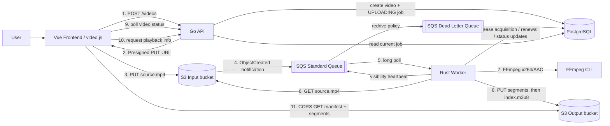
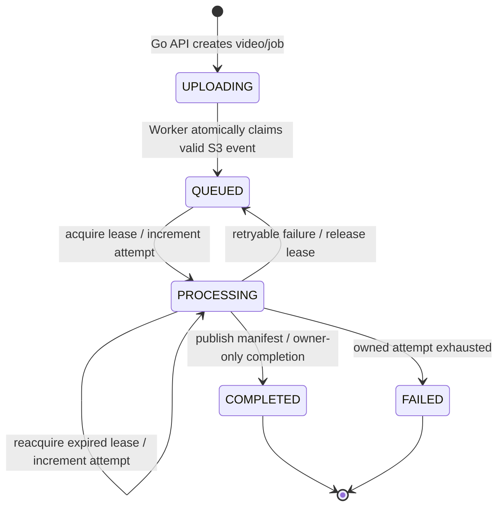

# Streaming Video App

## Project Overview

Streaming Video App は、動画アップロードから非同期エンコード、HLS生成、ブラウザ再生までを一つのパイプラインとして学ぶための、個人開発MVPです。自己学習とポートフォリオを主目的とし、APIの応答処理と時間のかかる動画変換を分離した、最小のストリーミング動画アプリケーションを実装しています。

Phase 2では次の正常系パイプラインに加え、lease・heartbeat・上限付き再試行・DLQ隔離・キュー監視と障害注入E2Eを実装しています。

```text
Upload -> asynchronous Encode -> HLS generation -> Playback
```

このリポジトリは本番向け動画配信サービスではありません。Phase 2では、Frontend、Go API、Rust Worker、PostgreSQLをローカルで実行し、S3、SQS/DLQ、IAM、CloudWatchアラームは実AWSを利用します。

## What this application does

ユーザーはブラウザでMP4ファイルを1つ選び、アップロードします。動画データはAPIサーバーを経由せず、Go APIが発行したPresigned PUT URLを使ってInput S3 bucketへ直接送信されます。

アップロード完了をS3の `ObjectCreated` 通知がSQSへ伝え、Rust Workerがメッセージを受信します。WorkerはInput bucketから動画を取得し、FFmpeg CLIで単一品質のHLS playlistとMPEG-TS segmentsへ変換します。変換結果はOutput S3 bucketへ配置され、ジョブ完了後にFrontendがvideo.jsを使って再生します。

Frontendは処理中、Go APIをポーリングしてジョブ状態を表示します。現在はCloudFrontを使用せず、ブラウザがOutput S3 bucketのHLSオブジェクトをCORS経由で直接取得します。

## Architecture Overview



責務の境界は次のとおりです。

- Go APIはジョブを作成し、アップロード先を発行し、現在状態と再生情報を返します。動画本体の中継やエンコードは行いません。
- Rust WorkerはSQSメッセージを起点に、claim、ダウンロード、エンコード、公開、状態更新を行います。ブラウザ向けAPIは提供しません。
- Frontendはユーザー操作、S3への直接アップロード、状態ポーリング、HLS再生を担当します。AWS認証情報は持ちません。
- PostgreSQLは動画メタデータ、アップロード情報、現在のジョブ状態を保持します。
- TerraformはS3、SQS/DLQ、IAM、CloudWatchアラームを定義します。Frontend、API、Worker、PostgreSQLのAWSデプロイは定義しません。

## Component Responsibilities

### Frontend

`frontend/` は Vue 3、TypeScript、Viteで構成されています。

- 空でない `video/mp4` ファイルを1つ受け付ける
- `POST /videos` で動画とエンコードジョブを作成する
- APIレスポンス内のPresigned URL、HTTP method、headersを使ってS3へ直接PUTする
- 既定1秒間隔で `GET /videos/{videoId}` をポーリングする
- `FAILED` をエラー表示し、`COMPLETED` で再生情報を取得する
- video.jsへHLS manifest URLを渡して再生する
- APIレスポンスを実行時に検証し、契約外の値をエラーとして扱う

### Go API

`backend/api/` はGoの標準 `net/http`、AWS SDK for Go v2、pgxを利用します。

- `POST /api/v1/videos`
  - `fileName`、`contentType`、`sizeBytes` を検証する
  - Phase 1では `video/mp4`、1 byte以上5 GiB以下だけ受け付ける
  - video IDとjob IDを生成する
  - jobを `UPLOADING` としてPostgreSQLへ保存する
  - 15分有効のS3 Presigned PUT URLを発行する
- `GET /api/v1/videos/{videoId}`
  - 動画メタデータと現在のジョブ状態を返す
- `GET /api/v1/videos/{videoId}/playback`
  - `COMPLETED` のときだけHLS manifest URLを返す
  - 未完了時は `409 VIDEO_NOT_READY` を返す
- `GET /api/v1/health`
  - ComposeとE2E preflight用のヘルスチェックを返す
- 設定されたFrontend originだけにJSON APIのCORSを許可する

APIは起動時にPostgreSQL接続、`videos` / `jobs` table、AWS credential providerを確認します。S3へのアップロード完了通知やSQSへのメッセージ送信はAPIの責務ではありません。

### Rust Worker

`backend/worker/` はCargo workspaceで、`worker`、`encoding`、`queue`、`storage`、`persistence` crateに責務を分けています。

- SQSを20秒long pollingし、1回に1 messageを受信する
- 1 process内の処理数を固定上限に抑える（現在の上限は2）
- standard S3 Event Notificationの全 `Records` を解析する
- event name、Input bucket、URL decode後のobject key、UUID形式を検証する
- PostgreSQLの条件付きUPDATEで `UPLOADING -> QUEUED` を原子的にclaimする
- 未所有または期限切れのleaseを原子的に取得し、PROCESSINGへの遷移とattempt加算を行う
- heartbeatでDB leaseとSQS visibilityを延長し、所有権喪失時は処理を中断する
- lease取得後にInput S3 objectを一時ディレクトリへ保存する
- shellを介さずFFmpeg CLIを起動し、H.264/AAC、6秒segment、VOD形式のHLSを生成する
- playlistと連番segmentの存在・安全な相対パスを検証する
- Output S3へ全segmentsを先にuploadし、`index.m3u8` を最後にuploadする
- 一時ファイル削除後、jobを `COMPLETED` にする
- 通知内の全jobが完了済みの場合だけSQS messageをdeleteし、完了済み再配送では再エンコードしない
- 再試行可能な失敗はowner条件付きでQUEUEDへ戻し、固定遅延後の再配送を要求する
- 所有中の試行上限到達時の失敗をFAILEDとし、通知はSQS redriveによるDLQ移動に任せる
- PostgreSQL接続終了時は受信・処理を停止して異常終了する
- 処理完了時も進行中のSQS受信を保持し、応答を処理へ引き渡す

Worker containerには固定バージョンのFFmpeg / ffprobe 7.1.1が含まれ、非root userで実行されます。

通常Composeは `unless-stopped` でWorkerを再起動し、DB接続を張り直します。障害注入用の `compose.e2e.yaml` は `restart: "no"` とし、シナリオが同じコンテナのstop/startを制御します。詳細は [再試行と冪等性のrunbook](./docs/runbooks/retry-and-idempotency.md) を参照してください。

### Infra

`infra/terraform/` は共通のAWS foundation、`infra/terraform-e2e/` は独立したstateを持つReliability E2E専用ルートです。

- 分離されたInput / Output S3 buckets
- SQS Standard Queue、DLQ、受信回数上限に基づくredrive policy
- source最古メッセージ年齢・source可視件数・DLQ可視件数の3つのCloudWatchアラーム
- `s3:ObjectCreated:*` からSQSへの通知
  - prefix: `videos/`
  - suffix: `/source.mp4`
- Input bucketのpublic access blockと、FrontendからのPUT CORS
- Output bucketのHLS prefixだけに限定したpublic `s3:GetObject` とGET/HEAD CORS
- S3からSQSへの送信を `SourceArn` / `SourceAccount` で制限したqueue policy
- Go API用のInput `s3:PutObject` 権限
- Rust Worker用のSQS consume、Input read、Output write権限
- API / Workerで分離されたローカル実行用IAM usersとpolicies

TerraformはIAM access keyを生成しません。認証情報の発行・保管・ローテーションはこのリポジトリの対象外です。

### Contracts

`contracts/` がコンポーネント間の共有契約です。

- [OpenAPI 3.1 contract](./contracts/openapi/api.yaml): create、status、playback APIとレスポンス例
- [Job status schema](./contracts/domain/job-status.schema.json): 公開APIの5状態
- [Reliability conventions](./contracts/domain/reliability-conventions.md): lease、attempt、retry、heartbeat、ack、DLQの契約
- [Storage conventions](./contracts/domain/storage-conventions.md): bucketの役割、S3 keys、S3 event、HLS公開順序
- `contracts/examples/api/`: OpenAPIから参照されるcanonical API examples
- `contracts/examples/s3/object-created.json`: Workerが解釈するcanonical S3 notification fixture

現在も独自の `encoding-requested`、`encoding-progress`、`encoding-completed` eventsを使用しません。SQS message bodyはAWS標準のS3 Event Notification JSONです。

## End-to-End Flow

1. ユーザーがFrontendで空でないMP4ファイルを1つ選びます。
2. Frontendがファイル名、`video/mp4`、サイズをGo APIへ送ります。
3. Go APIがvideo/job IDsとcanonical Input keyを生成し、そのkey専用のPresigned PUT requestを作成します。
4. Go APIがPostgreSQLへvideoと `UPLOADING` jobをtransactionで保存し、Presigned URLをFrontendへ返します。
5. BrowserがAPIを経由せず、返されたURLとheadersで動画をInput S3 bucketへPUTします。
6. S3がkey filterに一致する `ObjectCreated:*` notificationをSQSへ送ります。
7. Rust Workerがnotificationを受信し、Input bucketとkeyを検証して、jobを原子的に `QUEUED` へclaimします。再配送も含め、続くlease取得結果で処理可否を決めます。
8. Workerが未所有または期限切れのleaseを取得してattemptを加算し、jobをPROCESSINGにします。heartbeatを開始し、元動画をInput S3から一時ディレクトリへ取得します。
9. WorkerがFFmpegで単一品質のHLS playlistとMPEG-TS segmentsを生成し、生成物を検証します。
10. WorkerがsegmentsをOutput S3へuploadし、公開境界となる `index.m3u8` を最後にuploadします。
11. Workerが一時ディレクトリを削除し、jobを `COMPLETED` にしてからSQS messageをdeleteします。再試行可能な失敗はQUEUEDへ戻し、試行上限到達時の失敗はFAILEDにします。所有権喪失やDB結果が不確かな場合は終端状態を確定せず、通知を残します。
12. Frontendはstatus APIをポーリングし、`COMPLETED` 後にplayback APIからmanifest URLを取得します。
13. video.jsがOutput S3からmanifestと相対参照されたsegmentsをCORS GETし、動画を再生します。

## Repository / Directory Structure

次は現在の `app/` 配下を責務単位で要約したものです。将来案ではなく、実在する構成だけを示しています。

```text
app/
├── frontend/                       # Vue UI、API client、video.js、Vitest / Playwright
│   ├── src/
│   │   ├── api/                    # API types、response validation、direct upload
│   │   ├── config/                 # VITE_API_BASE_URL
│   │   └── App.vue                 # upload -> polling -> playback workflow
│   └── e2e/                        # 正常系・Reliability E2Eと運用ガイド
├── backend/
│   ├── api/                        # Go HTTP API
│   │   ├── cmd/api/                # process entrypointとruntime wiring
│   │   └── internal/
│   │       ├── config/             # environment validation
│   │       ├── httpapi/            # health、create、status、playback
│   │       ├── persistence/        # PostgreSQL repository
│   │       └── bootstrap/          # server lifecycle
│   └── worker/                     # Rust Cargo workspace
│       └── crates/
│           ├── worker/             # orchestration、event parsing、terminal states
│           ├── encoding/           # FFmpeg executionとHLS validation
│           ├── queue/              # SQS port / adapter
│           ├── storage/            # S3 port / adapter
│           └── persistence/        # PostgreSQL job-state transitions
├── infra/terraform/                # S3 / SQS / DLQ / IAM / alarms
├── infra/terraform-e2e/             # 専用AWS環境と独立state
├── contracts/
│   ├── openapi/                    # REST API contract
│   ├── domain/                     # job statusとstorage conventions
│   └── examples/                   # canonical API / S3 fixtures
├── docs/
│   ├── adr/                        # architecture decisionsと将来構想
│   └── runbooks/                   # local Compose手順
├── scripts/
│   ├── validate_contracts.py       # OpenAPI / examples / domain整合性
│   ├── validate_terraform_contracts.py
│   ├── start-e2e-compose.sh        # Phase 1正常系E2E runtime起動
│   ├── setup_reliability_env.sh    # Bashへ統合設定を反映（.mjsと連携）
│   └── run_reliability_e2e.py      # 事前確認・シナリオ・証跡管理
├── config/                         # 現在は空の予約領域
├── compose.e2e.yaml                # 専用DB・ラベル・restart policy
├── compose.yaml                    # PostgreSQL、migration、API、Worker、Frontend
└── .env.example                    # local runtime設定例（実credentialは含まない）
```

API migrationの実体は `backend/api/internal/persistence/migrations/` にあります。Composeの `migrate` serviceがAPI / Workerの起動前に適用します。

## Shared Contracts

変更時は、各言語内の型だけでなく `contracts/` との一致を保つ必要があります。

| 契約 | 主な利用者 | 固定している内容 |
| --- | --- | --- |
| OpenAPI | Frontend / Go API | request、response、error、UUID、5 GiB上限、playback readiness |
| Job status schema | Frontend / Go API / Rust Worker / PostgreSQL | `UPLOADING`, `QUEUED`, `PROCESSING`, `COMPLETED`, `FAILED` |
| Storage conventions | Go API / Rust Worker / Terraform / Frontend | bucket分離、input key、S3 notification、HLS keys、公開順序 |
| Reliability conventions | Worker / DB / Infra / E2E | lease所有権、attempt、retry、heartbeat、ack / DLQ |
| API examples | Contract validator | OpenAPI schemaに対するcanonical payloads |
| S3 example | Rust Worker / Contract validator | AWS標準 `ObjectCreated` message body |

OpenAPIに含まれない `GET /api/v1/health` は、アプリケーション機能ではなくローカルruntimeとE2E用の運用endpointです。

## Job State Flow



Go APIが作成時のUPLOADINGを設定し、その後の遷移はWorkerが行います。claimとlease取得は別操作です。lease取得時にのみ内部のattemptを加算し、有効なownerだけが更新・公開・完了・失敗確定を行います。worker_id、attempt、lease_expires_atは公開APIには追加しません。

crash後は、SQS再配送時にleaseが期限切れで試行予算が残っていれば取得し直します。COMPLETEDは再取得せず、再配送では削除だけを再試行します。DLQ移動はSQSの受信回数に基づき、DBのattemptとは別です。DLQに移っただけではDB状態はFAILEDに変わりません。

## HLS / S3 Object Layout

InputとOutputは必ず別bucketです。これによりWorker出力がInput notificationへ再帰的に入り、エンコードループになることを防ぎます。

```text
Input bucket
└── videos/{video_id}/jobs/{job_id}/source.mp4

Output bucket
└── videos/{video_id}/jobs/{job_id}/hls/
    ├── segment-00000.ts
    ├── segment-00001.ts
    ├── ...
    └── index.m3u8                 # 最後にupload
```

| Object | Content-Type | 公開方法 |
| --- | --- | --- |
| `source.mp4` | `video/mp4` | 非公開。Presigned PUTとWorker readのみ |
| `segment-{nnnnn}.ts` | `video/mp2t` | HLS prefixにpublic GET + CORS |
| `index.m3u8` | `application/vnd.apple.mpegurl` | HLS prefixにpublic GET + CORS |

Playlist内のsegment参照は `segment-00000.ts` のような相対名です。manifestを最後に公開し、その後でjobを `COMPLETED` にすることで、Frontendが不完全なplaylistを取得する時間帯を避けます。

## Technology Stack

| Area | Technology |
| --- | --- |
| Frontend | Vue 3.5, TypeScript 6, Vite 8, video.js 8, Pinia, Vue Router |
| API | Go 1.25.1, `net/http`, AWS SDK for Go v2, pgx v5 |
| Worker | Rust 1.98, Tokio, AWS SDK for Rust, tokio-postgres |
| Media | FFmpeg / ffprobe 7.1.1 in the Worker image, H.264 + AAC, HLS MPEG-TS |
| Database | PostgreSQL 16 |
| AWS | S3, SQS Standard Queue / DLQ, IAM, CloudWatch alarms |
| Infrastructure | Terraform >= 1.6, AWS provider `~> 5.0` |
| Local runtime | Docker Compose |
| Validation | Python 3.11+, JSON Schema, PyYAML, Vitest, Playwright, Go test, Cargo test |

## Local Development / Setup

### Prerequisites

- Docker EngineまたはDocker DesktopとDocker Compose
- 実AWS account内に、`infra/terraform/` に対応するS3、SQS/DLQ、IAM、アラームが存在すること
- Input bucketとOutput bucketが別名であること
- Input S3 CORSのorigin、Output S3 CORSのorigin、`FRONTEND_ORIGIN` が実際のFrontend originと一致すること
- APIとWorkerに別々の最小権限AWS credentialsを用意すること

通常開発用のAWS resourcesはCompose起動前に `infra/terraform/` で用意してください。既存環境を使う場合も、この通常開発用stateの出力とIAM userを確認します。S3 / SQSは実AWSを使用するため、Composeだけでは作成されません。

`infra/terraform-e2e/` と `compose.e2e.yaml`、`setup_reliability_env.sh --start-services` はReliability E2E専用です。これらの準備・起動手順は後述の [Reliability E2E（Phase 2）](#reliability-e2ephase-2) を参照してください。

### Configuration

`app/.env.example` を `app/.env` にコピーし、placeholderと認証情報を通常開発用の値へ置き換えます。既存の `.env` がある場合は上書きせず、内容を確認・更新してください。

通常開発用Terraformの出力は、repository rootから次のコマンドで確認できます。

```sh
terraform -chdir=app/infra/terraform output
```

`aws_region`、`video_input_bucket_name`、`video_output_bucket_name`、`video_encoding_queue_url` をそれぞれ `.env` の `AWS_REGION`、`VIDEO_INPUT_BUCKET`、`VIDEO_OUTPUT_BUCKET`、`VIDEO_ENCODING_QUEUE_URL` に反映します。`OUTPUT_S3_ENDPOINT` もそのOutput bucketとregionに合わせます。`api_local_execution` / `worker_local_execution` のIAM userに対応する認証情報を `API_AWS_*` / `WORKER_AWS_*` に設定してください。Terraformはaccess keyを発行しません。

E2Eセットアップを `source` したシェルでは、AWS接続先・Worker設定・API URLなどがexportされています。Composeではシェルの環境変数が `--env-file` の値より優先されるため、通常開発はE2E設定を読み込んでいない新しいターミナルで実行してください。シェルの起動設定でもこれらをexportしている場合は解除し、`.env` 自体にもE2E用の接続先や認証情報が残っていないことを確認します。

主なruntime variablesは次のとおりです。

| Variable | Consumer | Purpose |
| --- | --- | --- |
| `DATABASE_URL` | host上のAPI / Worker / tests | hostからPostgreSQLへ接続 |
| `COMPOSE_DATABASE_URL` | Compose API / Worker / migration | Compose network内のPostgreSQLへ接続 |
| `AWS_REGION` | API / Worker | AWS region |
| `VIDEO_ENCODING_QUEUE_URL` | Worker | SQS queue URL |
| `VIDEO_INPUT_BUCKET` | API / Worker | upload先とsource read元 |
| `VIDEO_OUTPUT_BUCKET` | API / Worker | HLS write先 |
| `OUTPUT_S3_ENDPOINT` | API | S3接続先。CloudFront URLを設定しない |
| `PLAYBACK_BASE_URL` | API | 必須のCloudFront HTTPS origin。Terraformの `playback_base_url` を設定する |
| `FRONTEND_ORIGIN` | API / S3 configuration | 許可するbrowser origin |
| `VITE_API_BASE_URL` | Frontend | Go API base URL。既定は `http://localhost:8080/api/v1` |
| `HTTP_ADDR` | API | listen address。Compose内は `0.0.0.0:8080` |
| `FFMPEG_PATH` | Worker / E2E fixture | FFmpeg executable path |
| `TMPDIR` | Worker | per-job temporary directory root |
| `API_AWS_*` | Compose API | API専用AWS credentials |
| `WORKER_AWS_*` | Compose Worker | Worker専用AWS credentials |
| `WORKER_HEARTBEAT_INTERVAL_SECONDS` | Worker | heartbeat間隔（秒） |
| `WORKER_VISIBILITY_EXTENSION_SECONDS` | Worker | SQS visibility延長（秒） |
| `WORKER_LEASE_DURATION_SECONDS` | Worker | DB lease期間（秒） |
| `WORKER_RETRY_DELAY_SECONDS` | Worker | 再試行の固定遅延（秒） |
| `WORKER_MAXIMUM_ATTEMPTS` | Worker | lease取得の試行上限（1〜10） |

heartbeat間隔の2倍がlease期間・visibility延長・sourceキューのvisibility以下になるよう設定します。通常Composeの既定値は順に30 / 120 / 300 / 900秒、5試行です。Reliability E2Eは専用Terraformの5 / 120 / 60 / 10秒、3試行を使い、統合セットアップで反映します。

### Start the complete local stack

repository rootから `app/` へ移動し、通常用の `compose.yaml`、`.env`、プロジェクト名 `app`（このディレクトリの既定名）を明示して起動します。

```sh
cd app
docker compose -p app --env-file .env -f compose.yaml config --quiet
docker compose -p app --env-file .env -f compose.yaml up --build -d
docker compose -p app --env-file .env -f compose.yaml ps -a
```

`postgres`、`api`、`worker`、`frontend` が起動し、`migrate` が終了コード0で完了していることを確認します。通常用PostgreSQLのコンテナ名は `streaming-video-postgres`、データvolume名は `streaming-video-postgres-data` です。

Reliability E2Eの既定プロジェクト名は `streaming-video-e2e` です。Frontend / APIの既定ポートは通常環境と重なるため、E2Eが起動中の場合はテスト終了後にその環境を停止してから通常環境を起動してください。プロジェクトを分けてもAWS接続先は自動では分離されないため、前述の `.env` とシェル環境の確認が必要です。

既定の接続先は次のとおりです。

- Frontend: `http://localhost:5173`
- Go API: `http://localhost:8080/api/v1`
- API health: `http://localhost:8080/api/v1/health`
- PostgreSQL host port: `5432`

ログ確認と停止:

```sh
docker compose -p app --env-file .env -f compose.yaml logs -f api worker frontend
docker compose -p app --env-file .env -f compose.yaml down
```

ローカルPostgreSQL dataを含むvolume削除は破壊的です。必要な場合だけ、[local Compose runbook](./docs/runbooks/local-compose.md) の注意事項を確認してください。

## Validation / Tests

以下は現在リポジトリに存在する検証方法です。コマンドはrepository rootから実行します。

### Shared contracts

Root Python projectはPython 3.11以上、PyYAML、jsonschemaを定義しています。

```sh
python -m pip install -e .
python app/scripts/validate_contracts.py
```

OpenAPI外部参照、API examples、job statuses、`FAILED` / `failure` semantics、S3 event fixture、S3 keyとHLS manifest URLの整合を検証します。

### Terraform architecture contract

```sh
python app/scripts/validate_terraform_contracts.py --stage reliability
```

このvalidatorはTerraform CLIやAWSへ接続せず、S3/SQS notification、CORS、public read範囲、queue policy、API / Worker IAM分離、DLQ、heartbeat時間設定、CloudWatchアラームを静的に検証します。

### Component tests

```sh
go test -C app/backend/api ./...
cargo test --manifest-path app/backend/worker/Cargo.toml --workspace --locked

npm --prefix app/frontend ci
npm --prefix app/frontend run test:unit -- --run
npm --prefix app/frontend run build
npm --prefix app/frontend run test:e2e:helpers
npm --prefix app/frontend run test:e2e:type-check
```

### Full Phase 1 E2E

Full E2Eはmock storageではなく、実際のS3/SQSとローカルCompose stackを使用します。disposableなE2E環境を使ってください。テストはAWSへ動画とHLS objectsを作成します。

必要なAWS resource variablesとAPI / Worker credentialsをshell environmentへ設定した後、repository rootからBashで起動します。

```sh
bash app/scripts/start-e2e-compose.sh
```

このscriptは既定でAPI host portを `8000`、Frontendを `5173` にし、両serviceとWorkerの起動を待ちます。Playwright用MP4 fixtureを生成するため、host側にもFFmpegが必要です。

```sh
E2E_ENVIRONMENT=disposable \
E2E_FRONTEND_URL=http://localhost:5173 \
E2E_API_URL=http://127.0.0.1:8000 \
E2E_PROJECT=chromium \
FFMPEG_PATH=/usr/bin/ffmpeg \
npm --prefix app/frontend run test:e2e
```

E2Eは、Browserの単一direct PUT、状態遷移、HLS object layout / content types、manifestとsegmentsのbrowser GET、video.js初期化、再生時間の進行まで確認します。

### Reliability E2E（Phase 2）

専用AWS環境、ホスト・Worker・API認証、正常／不正MP4、Linux版Node.js、Terraform、AWS CLI、Docker Compose、ホストFFmpeg・Chromiumを準備します。詳細は [運用ガイド](./frontend/e2e/reliability/runner.md) に集約しています。

リポジトリルートのWSL / Linux Bashで実行します。アカウントとfixtureパスは対象環境に置き換えてください。

```bash
source app/scripts/setup_reliability_env.sh \
  --account 123456789012 \
  --fixture "$HOME/e2e/long.mp4" \
  --invalid-fixture "$HOME/e2e/invalid.mp4" \
  --start-services
```

成功後、同じシェルで以下を順に実行し、失敗した場合は後続へ進みません。

```bash
python app/scripts/run_reliability_e2e.py --check
python app/scripts/run_reliability_e2e.py --live-preflight
python app/scripts/run_reliability_e2e.py --scenario preflight
python app/scripts/run_reliability_e2e.py --full
```

起動済み環境の設定を読み込む場合は同じ引数から起動オプションを省略します。設定やコンテナを更新する場合はE2E終了後に再セットアップします。

フル実行は重複配送、crash recovery、長時間heartbeat、FFmpeg試行上限、poison隔離、キュー監視を実施し、最後に新規アップロードとブラウザ再生を検証します。証跡は既定で `artifacts/reliability-e2e/` に保存されます。DLQメッセージが人手確認用に残るシナリオがあり、無条件のpurgeや再投入は行いません。

helperテストはオフラインで実行できますが、実環境シナリオはAWSへの書き込みやWorker停止を伴います。通常のPhase 1 E2E起動スクリプトを専用セットアップの代用にはしません。

## Phase Scope

ロードマップの原典は [ADR-001](./docs/adr/adr-001-video-streaming-mvp-architecture.md) です。

### Phase 1 — implemented pipeline

- Browser -> Go APIでvideo/job作成とPresigned PUT URL発行
- Browser -> Input S3への直接upload
- Input S3 `ObjectCreated:*` -> SQS Standard Queue
- Rust WorkerによるS3 event解析とatomic claim
- PostgreSQLによる5状態のjob管理
- FFmpeg CLIによる単一品質HLS生成
- segments -> `index.m3u8` -> `COMPLETED` の公開順序
- Output S3からのdirect HLS playbackとCORS
- Vue Frontendによるupload、polling、video.js playback
- ローカルCompose runtimeと実AWSを使うPlaywright E2E harness
- S3、SQS、IAMのPhase 1 Terraform configuration

ソースコードとテストharnessは存在しますが、実際のE2E成功には正しく構成されたAWS resourcesとcredentialsが必要です。リポジトリだけで特定AWS環境へのデプロイ済み状態までは保証しません。

### Phase 2 — implemented reliability

- DB lease取得・更新・期限切れ再取得、owner条件付きの状態更新
- SQS visibilityとDB leaseのheartbeat、所有権喪失時の処理中断
- 固定遅延・試行上限付き再試行、完了済み再配送での再処理防止
- DLQ / poison隔離、キューのCloudWatch metrics / alarmsと証跡
- DB接続終了の監視とWorker異常終了、進行中のSQS受信の保持
- 専用Terraform / Compose、統合セットアップ、障害注入E2Eと復旧runbook

CloudFront + OAC、private Output S3、アプリ・DB・ネットワークのAWS配置、WorkerログのCloudWatch転送は未実装です。

### Phase 3 — future scalability and distributed encoding

次は将来構想で、現在のリポジトリには実装されていません。

- Step Functionsによる分割処理のorchestration
- ECS/FargateまたはAWS Batchによるdistributed encoding
- 動画、rendition、segment単位のparallel processing
- Auto Scaling
- ABRと複数renditions
- 必要に応じたFFmpeg C API最適化

## Known Limitations / Non-goals

- Authentication、user management、authorizationはありません。
- Phase 1の入力は空でないMP4 1ファイル、最大5 GiB、単一Presigned PUTだけです。multipart uploadはありません。
- HLSはH.264/AAC、6秒MPEG-TS segmentsの単一品質です。ABR、複数renditions、字幕、thumbnail、live streamingはありません。
- Output HLS prefixは匿名 `s3:GetObject` を許可します。CloudFront + OACによるprivate deliveryは未実装です。
- API、Worker、PostgreSQLはAWSへデプロイされず、Terraform管理されません。
- WorkerはS3 source object全体をmemoryへ収集してからlocal diskへ書き、upload時も各HLS fileをmemoryへ読み込みます。大容量・高並列処理向けではありません。
- 復旧はSQS再配送と残り試行回数が前提です。全ジョブを巡回する自動修復やDLQ自動再投入はありません。メッセージ削除・DLQ移動後にQUEUED / PROCESSINGが残った場合は状態確認と手動復旧が必要です。
- busy・無効通知・FAILEDはdeleteせず、SQS redriveに任せます。受信回数とDB試行回数は一致するとは限らず、DLQ移動だけでは非終端ジョブをFAILEDにしません。
- Worker processの受信・処理は固定上限で、distributed computeやautoscalingはありません。
- CORSは単一の設定済みFrontend originを前提とします。
- E2E環境は独立したlocal stateとComposeプロジェクトで分離します。共有remote stateとアプリのAWS deploymentは未整備です。

アーキテクチャの背景とPhaseごとの判断理由は [ADR-001](./docs/adr/adr-001-video-streaming-mvp-architecture.md)、storageと状態遷移の厳密な規約は [storage conventions](./contracts/domain/storage-conventions.md) を参照してください。

### Playback CloudFront URL Settings

APIは必須の `PLAYBACK_BASE_URL` に既存のHLSキーを連結します。S3への自動フォールバックはありません。ユーザー情報、パス、クエリ、フラグメントを含まないHTTPS originを指定してください。末尾のスラッシュは正規化します。APIのループバックHTTP許可はローカルテスト用です。

統合セットアップは `--playback-url` → 環境変数 `PLAYBACK_BASE_URL` → Terraform出力 `playback_base_url` の順で取得し、コンテナ起動前に検証します。明示的に指定した空値・不正値はエラーになります。Terraform未適用などで出力を取得できない場合も起動を停止します。

単独の `generate_reliability_env.mjs` はTerraformを参照しないため、`--playback-url` または環境変数を指定してください。`OUTPUT_S3_ENDPOINT` には引き続きS3の接続先を設定します。
