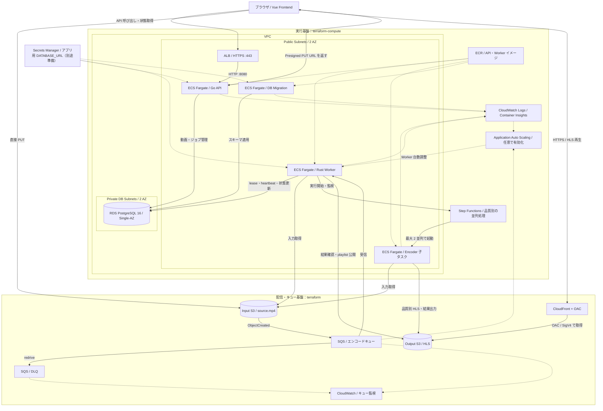
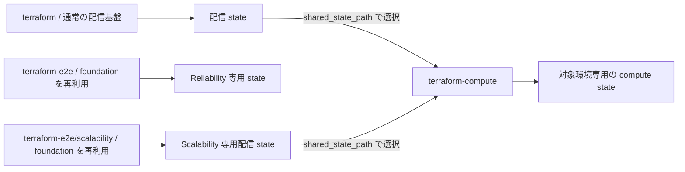

# インフラ構成

動画のアップロード、非同期エンコード、HLS 配信に必要な AWS リソースを Terraform で管理します。配信・キュー基盤とアプリケーション実行基盤を別の Terraform ルートに分け、ローカル実行と AWS 上での実行の両方に対応しています。

この README は、このディレクトリにある Terraform 定義を説明します。実際にデプロイ済みであることを示すものではありません。

## ディレクトリと管理範囲

| ディレクトリ | 役割 | 主な管理対象 |
| --- | --- | --- |
| [`terraform/`](./terraform/) | 共通の配信・キュー基盤。単独のルートとしても、E2E 用の子モジュールとしても使用 | Input/Output S3、SQS/DLQ、CloudFront/OAC、CORS、ローカル実行用 IAM、キュー監視アラーム |
| [`terraform-compute/`](./terraform-compute/) | AWS 上のアプリケーション実行基盤 | VPC、ALB、ECS Fargate、ECR、RDS、Step Functions、IAM ロール、ログ、Worker Auto Scaling |
| [`terraform-e2e/`](./terraform-e2e/README.md) | Reliability E2E 用の独立環境 | 共通基盤の再利用、試験用タイミング設定、E2E runner 用 IAM ポリシー |
| [`terraform-e2e/scalability/`](./terraform-e2e/scalability/README.md) | Scalability E2E 用の独立した配信基盤 | 共通基盤の再利用、専用の命名・タグ・アカウント制限。実行基盤には `terraform-compute/` を使用 |

Terraform の要求バージョンは `>= 1.6.0`、AWS Provider は `~> 5.0` です。リージョンの既定値は `ap-northeast-1` です。

## インフラ構成図

AWS 上で API・Worker を実行する場合の構成です。実線は主なリクエスト・処理の流れ、破線は設定の注入や監視・制御を表します。

ローカル実行では、API・Worker・PostgreSQL・Frontend を [Docker Compose](../compose.yaml) で動かし、AWS 側は共通の配信・キュー基盤を利用します。ローカル構成では `terraform-compute/` の ALB・RDS・ECS は不要です。Frontend のホスティング自体は、これらの Terraform 定義の管理対象に含まれません。

## 各リソースの役割

### 配信・キュー基盤

| リソース | 役割・設定 |
| --- | --- |
| Input S3 | アップロードされた元動画を保存。ブラウザは API が発行した Presigned PUT URL で直接送信 |
| S3 イベント通知 | `videos/` で始まり `/source.mp4` で終わるキーの `s3:ObjectCreated:*` を SQS に通知 |
| SQS | 非同期処理の待ち行列。Worker が受信・削除・visibility 延長を行う |
| DLQ | 受信回数が redrive の上限に達したメッセージを隔離。通常構成の既定上限は 5 回 |
| Output S3 | HLS playlist、segment、子タスクの処理結果を保存。Input と分離して出力による再エンコード通知を防止 |
| CloudFront + OAC | 非公開の Output S3 から HLS を取得して配信。S3 の読み取り許可は対象 distribution に制限 |
| CORS | 許可した Frontend origin からの Input PUT、Output GET/HEAD、CloudFront 経由の再生に対応 |
| ローカル用 IAM | API 用と Worker 用のユーザー・ポリシーを分離。アクセスキーの作成はこの定義に含まれない |
| CloudWatch アラーム | キューの最古メッセージ経過時間、可視メッセージ数、DLQ 件数を監視。通常構成の既定閾値は順に 900 秒、10 件、1 件。通知先は未設定 |

Input/Output S3 はともに Public Access Block を有効にしています。CloudFront の OAC は S3 オリジンへのアクセス制御であり、視聴者の認証ではありません。CloudFront の署名付き URL/Cookie による視聴制限は定義していません。

CloudFront は、上書きされる従来の HLS キーでは成功応答のキャッシュを無効にし、`/videos/*/jobs/*/hls/attempts/*` では試行ごとの不変な出力を最大 1 年キャッシュします。403/404 のエラーキャッシュ TTL は 0 です。内部結果ファイル `result.json` はバケットポリシーで CloudFront からの取得を明示的に拒否します。

### アプリケーション実行基盤

| リソース | 役割・設定 |
| --- | --- |
| VPC / Subnet / Security Group | 2 AZ に Public subnet と DB 用 Private subnet を配置。通信経路をリソースごとに制限 |
| ALB | HTTPS 443 を受け付け、Go API の HTTP 8080 に転送。ACM 証明書は外部で準備 |
| Go API service | 動画・ジョブの作成、Presigned URL 発行、状態・再生情報の取得。動画本体は中継しない |
| Rust Worker service | SQS 消費、DB lease 管理、再試行、Step Functions の起動・監視、結果確認と公開を担当。1 タスクの同時ジョブ数は 1 |
| Step Functions | `360p` / `720p` のうち 1～2 種類を検証し、Encoder を最大 2 並列で実行。実行期限と終了コードを検証 |
| Encoder task | Worker イメージの `encode-child` を実行し、品質別 HLS を生成。DB 接続情報や SQS 消費権限は持たない |
| Migration task | API イメージを使って DB スキーマを適用する単発タスク。Terraform はタスク定義を作成し、実行は運用手順で行う |
| RDS PostgreSQL 16 | 動画・ジョブ・lease・公開状態を保持。Single-AZ、非公開、ストレージ暗号化、バックアップ保持 1 日 |
| ECR | API と Worker のイメージを保管。タグは immutable、push 時スキャンを有効化。タスクは digest で固定 |
| IAM ロール | イメージ取得・ログ・Secret 注入用の execution role と、アプリの AWS 操作用 task role を分離 |
| CloudWatch | API・Worker・Encoder・Migration のログを 7 日保持。ECS Container Insights を有効化 |
| Application Auto Scaling | 可視キュー件数 ÷ 実行中 Worker 数を使う Target Tracking。既定では無効、有効化時の既定範囲は 1～4 タスク |

API・Worker・Encoder は Public subnet に配置し、Public IP と Internet Gateway を経由して ECR や AWS API に接続します。NAT Gateway は定義していません。API の受信は ALB の Security Group からの 8080 のみ、Worker の受信ポートは開放しません。RDS の 5432 は API/Worker の Security Group から許可します。DB subnet が 2 AZ にまたがっていても、RDS 自体は Multi-AZ 構成ではありません。

RDS 管理者パスワードは RDS に管理させ、アプリ用 `DATABASE_URL` は別途用意した Secrets Manager の ARN を指定してタスクへ注入します。管理者 Secret はアプリタスクへ注入しません。

## Terraform state と環境の関係

`terraform-compute/` は `terraform_remote_state` の local backend で配信 state を読み、バケット名、キュー URL、CloudFront ドメイン、Worker のタイミング設定を受け取ります。通常環境と Scalability E2E のいずれかの state を選び、先に配信基盤を作成します。配信と compute、および各環境の state は分離します。

Reliability E2E は独自のリソース名・タグ・アカウント制限を持ち、heartbeat 5 秒、visibility 120 秒、lease 60 秒、retry 10 秒、試行上限 3 回を設定します。Scalability E2E は配信基盤だけを専用ルートで作り、ECS・RDS・Step Functions の定義は `terraform-compute/` を再利用します。

Scalability E2E の state・plan・backend 設定・認証情報は、リポジトリ外の専用ディレクトリに保存します。このルートの backend 既定値は利用不能な値であり、初期化時に実際の state パスを指定する必要があります。具体的な設定例は各 E2E README と運用ガイドを参照してください。

## 導入の流れと運用資料

AWS 実行基盤の導入は、次の順で進めます。

1. 共通基盤または E2E 専用の配信基盤を作成する。
2. compute に配信 state のパス、Frontend origin、ACM 証明書 ARN、アプリ用 Secret ARN を設定する。Frontend origin は配信基盤の CORS と一致させる。
3. ECR を初期作成し、API/Worker イメージを push して digest を設定する。
4. API/Worker の desired count を 0、Auto Scaling を無効にした状態で実行基盤を作成する。
5. DB のアプリ用ロールと Secret の値を準備し、Migration task を実行する。
6. API/Worker を起動し、疎通と動画処理を確認してから必要に応じて Auto Scaling を有効化する。

API 用の DNS 名は ACM 証明書がカバーするものを別途設定します。compute の `api_base_url` output は ALB の生成ホスト名であり、その名前が証明書でカバーされるとは限りません。配信用 URL は共通基盤の `playback_base_url` / `PLAYBACK_BASE_URL` output を使用します。

| 資料 | 内容 |
| --- | --- |
| [Cloud runtime](../docs/runbooks/cloud-runtime.md) | ECR 初期作成、RDS・Secret 準備、Migration、API 起動 |
| [Worker scaling](../docs/runbooks/worker-scaling.md) | Worker デプロイ、Auto Scaling、タスク保護と監視 |
| [Distributed encoding](../docs/runbooks/distributed-encoding.md) | Step Functions と子タスクの検証・障害対応 |
| [CloudFront delivery](../docs/runbooks/cloudfront-delivery.md) | OAC、CORS、キャッシュ、配信確認 |
| [Reliability E2E](../frontend/e2e/reliability/runner.md) | 専用 AWS 基盤とローカル実行環境での障害注入試験 |
| [Scalability E2E](../docs/runbooks/scalability-e2e.md) | 分散処理とスケーリングの専用 AWS 環境・検証手順 |
| [DLQ redrive](../docs/runbooks/dlq-redrive.md) | DLQ の調査と再投入 |
| [Retry and idempotency](../docs/runbooks/retry-and-idempotency.md) | 再試行・重複配送・公開処理の扱い |
